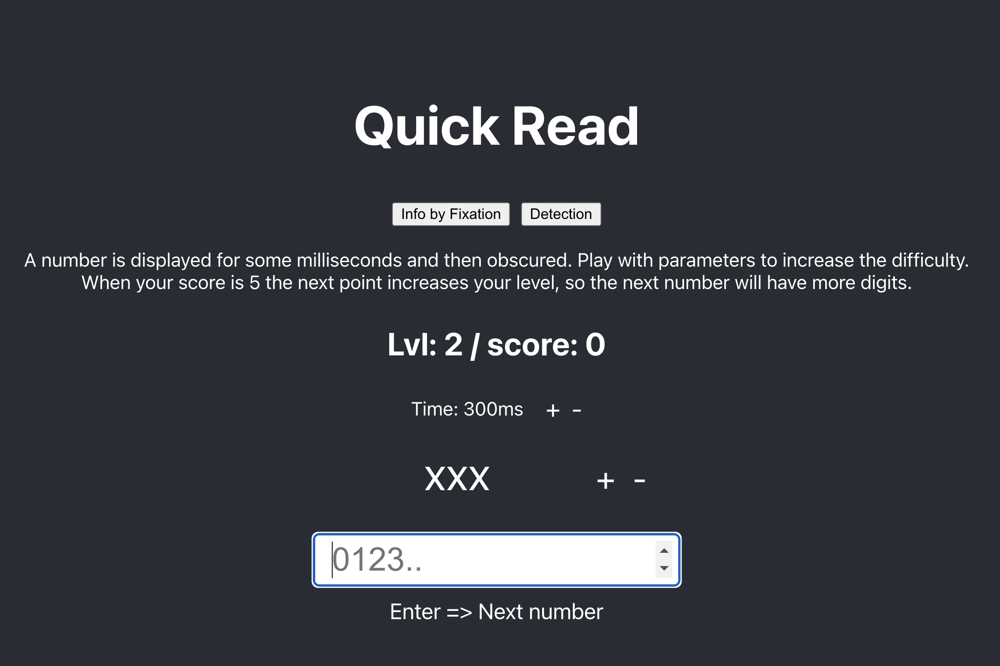
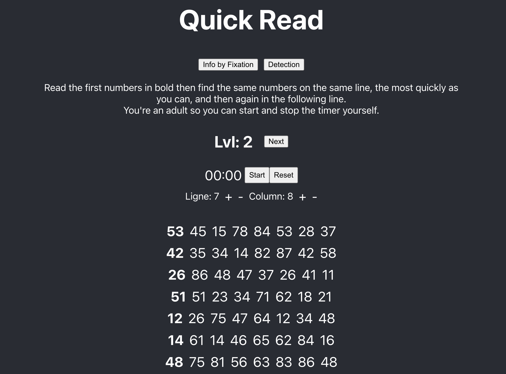

# Tools to Quick Read
Inspired by the book "The Speed Reading" by Tony Buzan.
Two training exercises are present:
1. Expand your vision to read a number at a glance.
2. Spot duplicates on a line in a minimum of time.

### Tools 1

### Tools 2

## Available Scripts
In the project directory, you can run:

### `yarn start`

Runs the app in the development mode.\
Open [http://localhost:3000](http://localhost:3000) to view it in the browser.
